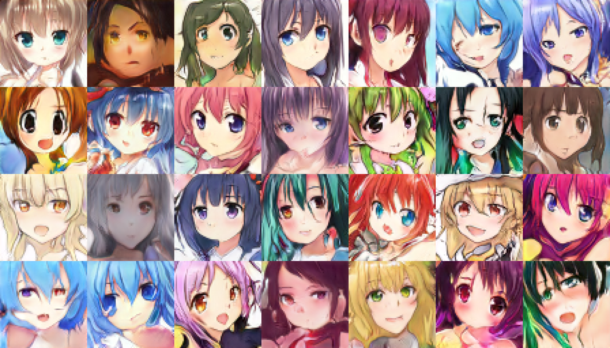
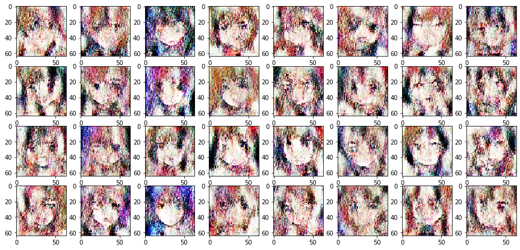
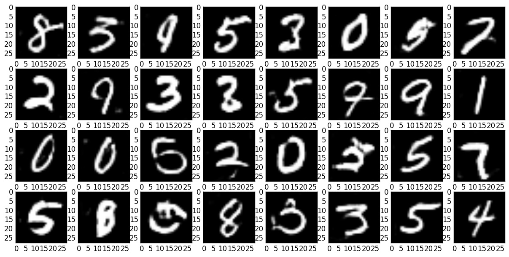

# Introduction
Apply several algorithms of Generative Adversarial Networks that can create anime faces. In this repository, I have applied four GAN Algorithms:  
1. Deep Convolutional Generative Adversarial Networks (DCGAN).  
2. Wasserstein Generative Adversarial Networks (WGAN).  
3. StyleGAN by Nvidia Research Labs.  
4. StyleGAN2 ADA (PyTorch) by Nvidia Research Labs.  
5. StyleGAN3 by Nvidia Research Labs.  
    
# Dataset
The dataset consists of high resolution 140,000 512x512 images of anime faces which is of about 11GB and can be downloaded [here](https://www.kaggle.com/lukexng/animefaces-512x512).  
  
# Implementation
The algorithms for the GAN models is provided in the respective directories.  
The models were trained on Nvidia K80 Tesla GPUs on XSEDE Portal except StyleGAN which was trained on Nvidia RTX 2070 since the subscription was over. StyleGAN2 ADA was trained on Nvidia RTX 3060 for about 3 days to improve the results.  
  
The GAN Algorithm consists of two neural networks, Generator and Discriminator. Generator takes random noise as input (np.random.normal() usually) and consists of several Convolutional Transpose layers that create the fake images. Discriminator takes a combination of real and fake images and applies a simple classification problem for real and fake images.  
  
The models are trained differently. First the generator model is trained using the noise and then the full GAN model is trained while training the discriminator. Therefore, while training the generator, the gradients are used only to update the generator. Where as, while training discriminator, the gradients update the weights for both generator and discriminator.  
  
# Observations
The model convergence while training GANs is difficult as there are two neural networks that are to be trained so it is difficult for hyperparameter optimization and it is common for either the generator or the discriminator model to collapse resulting in faulty training. While optimization is simpler for simpler dataset such as MNIST digits, the results would have been better if the model was trained for a longer duration. The primary goal for using a simpler dataset was to understand how to obtain the balance between the generator and discriminator and understand model collapses.  
  
Out of all the algorithms, StyleGAN 3 performed the best to generate anime faces. The observations are given below.  
  
1. StyleGAN3  

2. StyleGAN2 ADA  

3. StyleGAN  

4. DCGAN  
  
5. DCGAN for MNIST Digits  
  
6. WGAN  
The WGAN model faces generator collapse frequently and since StyleGAN outperforms WGAN, I invested more training time for StyleGAN than WGAN.  
  
# Timelapse Videos
Since the output after every epoch looks fascinating, I created timelapse videos uploaded on YouTube.  
Here are the timelapse videos to see how the generator progresses with number of epochs.  
  
1. StyleGAN3: StyleGAN3 videos will be uploaded shortly.  
<!--    -->
2. StyleGAN2  
  
3. StyleGAN  

4. DCGAN  

5. DCGAN for MNIST Digits  

# Comparing results for StyleGAN and StyleGAN2 ADA
StyleGAN3 achieved significantly faster performance as it was implemented on RTX3090Ti and the algorithm is designed such that the convergence is faster than StyleGAN2.  
StyleGAN2 ADA performes better than StyleGAN and was implemented a year after StyleGAN due to lack of resources. I tried to train StyleGAN2 ADA over Google Colab but it needed more memory so it was trained on a local computer on RTX 3060. StyleGAN2 ADA performs better and requires less training time. The results were more significant in less iterations as compared to StyleGAN. StyleGAN2 ADA was trained over 880 kimg whereas StyleGAN was trained for over 4421 kimg.  
  
The FID50k metric was used for evaluating the models. StyleGAN achieved an FID score of 119.83 whereas StyleGAN2 ADA achieved an FID score of 14.55.  
  
# Downloads
All the models will be deployed using HuggingFace.  
<!-- The trained models can be downloaded using this [Link](https://drive.google.com/drive/folders/1YyBgA7P4M0XkJjm4T6x_I4r-p0xbhMse?usp=sharing).   -->
  
<!-- The StyleGAN models can be downloaded using this [Link](https://drive.google.com/drive/folders/1vbgdM78-TMt3fGtfKGYN7XpaLiz2eX-9?usp=sharing).   -->
  
<!-- The StyleGAN2 model can be downloaded using this [Link](https://drive.google.com/file/d/1Eu3WWMleLsMTams9oAA1Wwbd8l5_p8dK/view?usp=sharing).   -->
  
# Licence Information
The Licence is MIT open source for the entire directory except StyleGAN, StyleGAN2, and StyleGAN3 which have their own licences present in their directories.
  
# Reference Papers
1. Radford, A., Metz, L., & Chintala, S. (2015). Unsupervised representation learning with deep convolutional generative adversarial networks. arXiv preprint arXiv:1511.06434. [DCGAN](https://arxiv.org/abs/1511.06434).
2. Arjovsky, M., Chintala, S., & Bottou, L. (2017). Wasserstein gan. arXiv preprint arXiv:1701.07875. [Wasserstein GAN](https://arxiv.org/abs/1701.07875).
3. Jin, Y., Zhang, J., Li, M., Tian, Y., Zhu, H., & Fang, Z. (2017). Towards the automatic anime characters creation with generative adversarial networks. arXiv preprint arXiv:1708.05509. [Improved version of DCGAN](https://arxiv.org/abs/1708.05509).
4. Karras, T., Laine, S., & Aila, T. (2019). A style-based generator architecture for generative adversarial networks. In Proceedings of the IEEE conference on computer vision and pattern recognition (pp. 4401-4410). [StyleGAN](https://arxiv.org/abs/1812.04948).
5. Radford, A., Metz, L., & Chintala, S. (2015). Unsupervised representation learning with deep convolutional generative adversarial networks.arXiv preprint arXiv:1511.06434. [Additional paper that creates bedrooms with GAN](https://arxiv.org/abs/1511.06434).
6. Heusel, M., Ramsauer, H., Unterthiner, T., Nessler, B., & Hochreiter, S. (2017). Gans trained by a two time-scale update rule converge to a local nash equilibrium. In Advances in neural information processing systems (pp. 6626-6637). [Fréchet Inception Distance which is used for evaluating GANs](http://papers.nips.cc/paper/7240-gans-trained-by-a-two-t).
7. Karras, T., Aittala, M., Hellsten, J., Laine, S., Lehtinen, J., & Aila, T. (2020). Training generative adversarial networks with limited data. Advances in neural information processing systems, 33, 12104-12114. [StyleGAN2 ADA](https://proceedings.neurips.cc/paper/2020/file/8d30aa96e72440759f74bd2306c1fa3d-Paper.pdf)
8. Karras, T., Aittala, M., Laine, S., Härkönen, E., Hellsten, J., Lehtinen, J., & Aila, T. (2021). Alias-free generative adversarial networks. Advances in neural information processing systems, 34, 852-863. [StyleGAN3](https://proceedings.neurips.cc/paper/2021/file/076ccd93ad68be51f23707988e934906-Paper.pdf)
