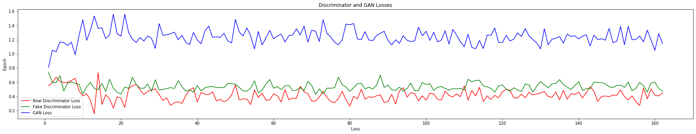
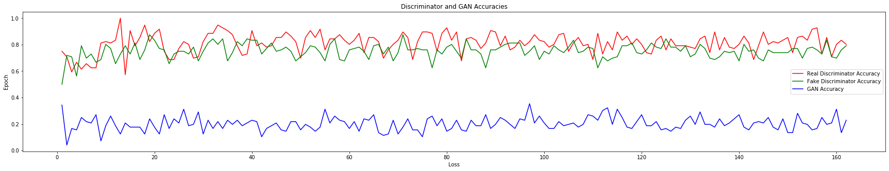
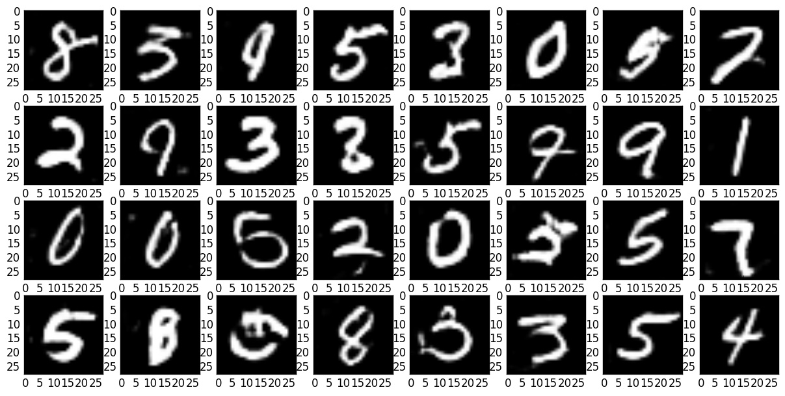

# Introduction
Create a Deep Convolutional Generative Adversarial Network that can create digits from MNIST. DCGAN is a deep convolutional neural network that has two models: Generator and Discriminator. The generator creates digits from random noise and the Discriminator identifies if the digits are created by the generator. While creating GAN, the important aspect is to obtain a balance between the generator and a discriminator which can be obtained by measuring and monitoring the loss.  
  
# Results
The GAN was trained for 150 epochs and the generated digits are clear and without any visible noise. The model can be further improved by running the model for higher epochs and fine-tuning the generator. The model losses and accuracies are shown below.  
  
  
  
A sample output of the GAN generated digits can be seen in the image below.  
  
  
The model can also be trained separately for individual digit which can obtain further promising results.  
  
# Evaluation
The best method of evaluating GANs is to visually see the results and notice the noise. However, GANs can also be evaluated using Fréchet Inception Distance (FID). FID measures how similar the generated image and the original image is by obtaining the disturbance levels in the two images and is given as:  
  
`This network obtains a Mean FID Score of 1.52 with Standard Deviation of 0.73.`  
  
# Downloads
The models can be downloaded from the Google Drive [link](https://drive.google.com/file/d/1bsSoo3s3mcA-qNuCrmMROlbHKR5NIVXK/view?usp=sharing).  
  